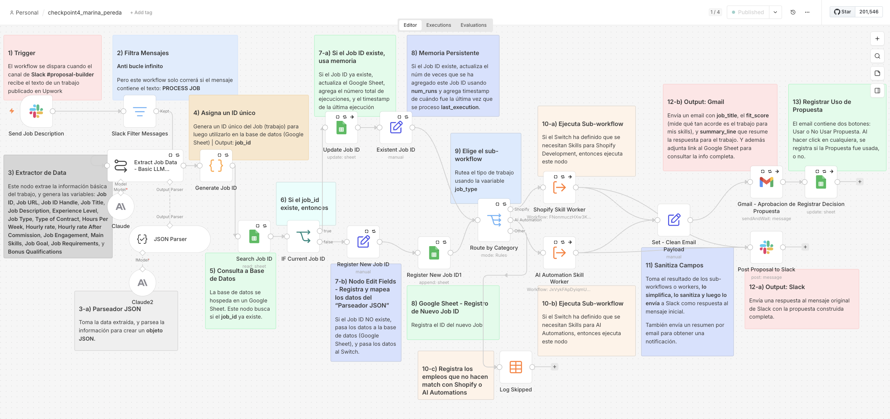

# Upwork Proposal Builder

Sistema de tres flujos de n8n que convierte una oferta de Upwork pegada en Slack en una propuesta escrita, registrada y aprobada por un humano.

Automatiza una tarea que antes hacía a mano cada vez que veía una oferta interesante: leer el post completo, decidir si encajaba conmigo, y escribir la propuesta desde cero.

Autora: Marina Pereda, Shopify Expert Developer, UX Consultant y CRO Strategist.

---

## Arquitectura

Patrón manager / worker con tres workflows independientes.

| Workflow | Rol |
|---|---|
| `checkpoint4_marina_pereda.json` | Manager. Escucha Slack, extrae los datos, deduplica, rutea, publica y pide aprobación. |
| `worker1_shopify.json` | Redacta propuestas para trabajos de Shopify Development. |
| `worker2_ai_automation.json` | Redacta propuestas para trabajos de AI Automation. |



### Conectores

| Rol | Herramienta | Autenticación |
|---|---|---|
| Entrada del equipo | Slack | OAuth2 |
| Fuente única de verdad | Google Sheets | OAuth2 |
| Verificación humana | Gmail | OAuth2 |
| Modelo | Anthropic Claude | API Key |

---

## Recorrido del flujo

**1. Trigger.** El workflow se dispara cuando el canal de Slack `#proposal-builder` recibe el texto de una oferta publicada en Upwork.

**2. Filtro de mensajes.** Bloquea el bucle infinito. La condición descarta mensajes de bot (`bot_id`) y avisos de sistema (`subtype`), y exige que el texto contenga la palabra clave `PROCESS JOB`. Sin este nodo, la propia respuesta del bot al canal volvería a disparar el flujo.

**3. Extractor de datos.** Un modelo de Claude lee el post y genera dieciséis variables: `Job ID`, `Job URL`, `Job ID Handle`, `Job Title`, `Job Description`, `Experience Level`, `Job Type`, `Type of Contract`, `Hours Per Week`, `Hourly rate`, `Hourly rate After Commission`, `Job Engagement`, `Main Skills`, `Job Goal`, `Job Requirements` y `Bonus Qualifications`. Un Structured Output Parser convierte la salida en un objeto JSON validado.

**4. ID único.** Un nodo de código genera un identificador estable a partir de la URL de la oferta. Antes de calcularlo normaliza la dirección: quita el envoltorio de enlace de Slack, el fragmento, los parámetros de seguimiento (`utm_*`, `fbclid`, `gclid`) y las barras finales, conservando los parámetros que sí forman parte de la identidad del recurso. La misma oferta compartida de dos formas distintas produce siempre el mismo `job_id`.

**5. Consulta a la base de datos.** Busca ese `job_id` en la hoja `Job Classification` del documento `Jobs Log - Upwork`.

**6 y 7. Decisión de existencia.** Un IF evalúa si la búsqueda devolvió una fila.

- **Ya existe** → actualiza la fila con `num_runs` incrementado y `last_execution` con el timestamp actual.
- **Es nueva** → mapea los campos del parser y registra la fila por primera vez, con `num_runs` en 1.

**8. Memoria persistente.** La hoja funciona como memoria a largo plazo del sistema: cada oferta queda registrada una sola vez, con cuántas veces se ha procesado y cuándo fue la última.

**9. Enrutamiento.** Un nodo Switch evalúa `job_type` y decide el destino.

**10. Sub-workflows.**

- `shopify` → worker de Shopify Development
- `ai automation` → worker de AI Automation
- cualquier otro valor → salida de reserva que registra el descarte en una tabla de auditoría, en lugar de perderlo en silencio

Cada worker recibe la oferta, la cruza con el perfil de habilidades correspondiente, redacta la propuesta con un agente de Claude, la valida con una herramienta de estilo, la guarda en la hoja y devuelve el resultado al manager.

**11. Sanitización del payload.** Reduce la salida del worker a ocho campos antes de tocar el conector de correo. Descarta el perfil de habilidades completo, la descripción original de la oferta y cualquier objeto binario.

**12. Salidas.**

- **Slack:** responde en el hilo del mensaje original con la propuesta completa lista para copiar.
- **Gmail:** envía un correo con `job_title`, `fit_score`, `summary_line` y un enlace a la hoja para consultar la información completa.

**13. Registro de la decisión.** El correo incluye dos botones, **Usar Propuesta** y **No Usar Propuesta**. La ejecución queda en pausa hasta que se pulsa uno de los dos, y la decisión se escribe en la columna `usage_status` de la fila correspondiente.

---

## Esquema de datos entre manager y workers

El contrato está declarado de forma explícita en ambos extremos, no implícita.

### Manager → Worker

El nodo `When Executed by Another Workflow` de cada worker usa el modo "Define using fields below" y declara los diecisiete campos que recibe:

```
job_id, job_url, job_handle, job_title, job_description, job_type,
experience_level, type_of_contract, hours_per_week, hourly_rate,
hourly_rate_after_commission, job_engagement, main_skills, job_goal,
job_requirements, bonus_qualifications, job_url_source
```

El manager los mapea uno a uno en el nodo Execute Workflow, de modo que ambos lados comparten un esquema visible y versionado en la interfaz.

### Worker → Manager

El worker devuelve **siempre el mismo objeto de doce campos**, tanto si tuvo éxito como si falló:

```json
{
  "status": "OK",
  "job_id": "...",
  "job_url": "...",
  "job_title": "...",
  "hourly_rate": "...",
  "fit_score": "STRONG | GOOD | WEAK",
  "client_need_summary": "...",
  "job_proposal_ai": "...",
  "screening_answers": [{ "question": "...", "answer": "..." }],
  "error_message": "",
  "error_node": "",
  "execution_id": "..."
}
```

Esa simetría es deliberada: el manager no necesita lógica distinta para leer una respuesta correcta o una fallida, solo evalúa el campo `status`.

---

## Manejo de fallos

El agente de cada worker tiene salida de error conectada a un nodo `Fallback Output` que emite el mismo contrato de doce campos con `status: ERROR`, el mensaje del error, el nodo donde ocurrió y el ID de ejecución.

En el manager, los nodos Execute Workflow usan reintentos y continúan la ejecución ante error, de forma que un worker caído nunca deja el manager bloqueado esperando una respuesta que no va a llegar. El mensaje de Slack es condicional: con `status: OK` publica la propuesta, y si no, publica un aviso de fallo con los datos necesarios para localizar la ejecución.

---

## Mínimo privilegio

| Conector | Permisos concedidos |
|---|---|
| Slack | `chat:write`, `channels:history`, `channels:read` |
| Google Sheets | Acceso limitado al documento `Jobs Log - Upwork` |
| Gmail | `gmail.compose` |

Una nota sobre Gmail: **Google no ofrece un scope que permita crear o enviar correos de aprobación sin permitir también el envío general.** La barrera de control humano no depende del permiso, sino del diseño del flujo. La propuesta nunca sale automáticamente hacia un cliente: el correo va únicamente a la propia autora y la ejecución queda detenida hasta que se pulsa uno de los dos botones.

---

## Puntos de control del checkpoint 4

| # | Nodo | Riesgo que neutraliza |
|---|---|---|
| ① | `Slack Filter Messages` | Bucle infinito de auto respuestas. Descarta mensajes de bot y de sistema, y exige la palabra clave `PROCESS JOB`. |
| ② | `Search Job ID` → `IF Current Job ID` → Update / Append | Duplicados. Sin este paso, la misma oferta generaba filas repetidas en la base de datos. |
| ③ | `Gmail - Aprobacion de Propuesta` | Ausencia de control humano. La ejecución se detiene hasta que un humano aprueba o rechaza. |
| ④ | `Set - Clean Email Payload` | Payload mal formado o saturado. Reduce a ocho campos y aplica valores por defecto para que ningún campo llegue vacío al conector. |

---

## Contenido del repositorio

```
checkpoint4_marina_pereda.json    Workflow manager
worker1_shopify.json              Sub-workflow de propuestas Shopify
worker2_ai_automation.json        Sub-workflow de propuestas AI Automation
docs/manager-workflow.png         Captura de la arquitectura del manager
README.md
```

---

## Cómo importar

1. En n8n, **Workflows → Import from File**, empezando por los dos workers.
2. Importar el manager.
3. Abrir los nodos `Shopify Skill Worker` y `AI Automation Skill Worker` y volver a seleccionar los sub-workflows, porque los IDs cambian entre instancias.
4. Configurar las credenciales de Slack, Google Sheets, Gmail y Anthropic.
5. Crear la hoja `Job Classification` con las columnas del esquema, incluidas `num_runs`, `last_execution`, `job_proposal_ai` y `usage_status`.
6. Publicar los tres workflows. El botón de aprobación del correo apunta a un webhook de la instancia, así que el manager debe estar activo para que funcione.
